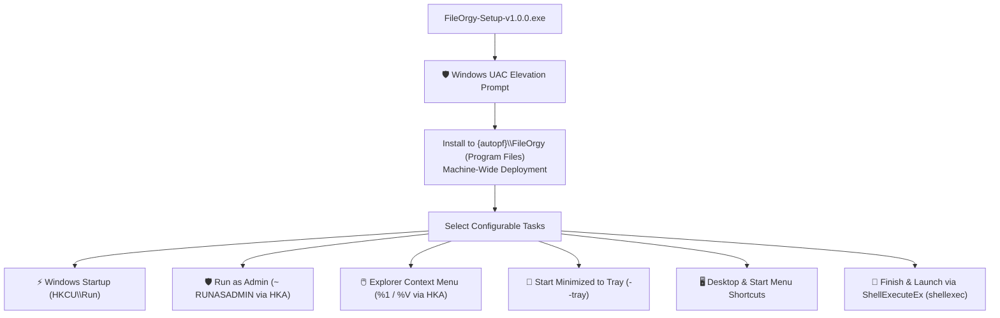
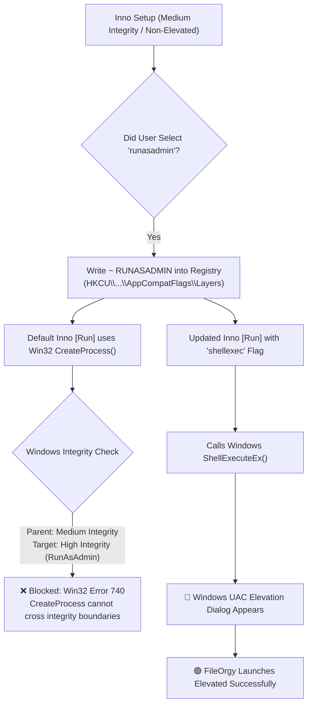

# FileOrgy: Windows Setup Installer & Deployment Guide

Welcome to the **FileOrgy Setup & Deployment Guide**. This document outlines how to install, configure, silently deploy, and cleanly uninstall FileOrgy using the native Windows Setup executable (`FileOrgy-Setup-v1.0.0.exe`).

---

## 1. Overview & Setup Architecture

FileOrgy is packaged using an ultra-lean, modern **Inno Setup 6** installer compiler:
* **Installer Binary:** `installer\FileOrgy-Setup-v1.0.0.exe` (~95.5 MB)
* **Target Architecture:** Windows 10 / 11 (64-bit x64)
* **Compression:** LZMA2/Ultra64 solid compression
* **Privilege Model:** Defaults to `PrivilegesRequired=admin` (machine-wide installation into `C:\Program Files\FileOrgy`, prompting for standard Windows UAC elevation on launch).
* **Launch Architecture:** Uses Windows `ShellExecuteEx` (`shellexec`) on completion, supporting seamless UAC consent prompts without Win32 Error 740.



---

## 2. Interactive Graphical Installation (GUI)

1. **Download / Locate Installer:**  
   Navigate to the `installer\` directory and double-click `FileOrgy-Setup-v1.0.0.exe`. Windows will display the User Account Control (UAC) prompt requesting administrative approval.
2. **Select Destination Location:**  
   * Standard machine-wide location: `C:\Program Files\FileOrgy`
   * Or specify a custom folder on your system.
3. **Select Additional Tasks (Configurable Toggles):**  
   Configure background monitoring, startup integration, privilege levels, and shortcuts.
4. **Ready to Install:**  
   Review the selected options and click **Install**. Extraction and registry configuration complete in 1–2 seconds.
5. **Finish & Launch:**  
   Choose whether to launch FileOrgy immediately.

---

## 3. Configurable Toggles Explained

During the **Select Additional Tasks** wizard step, the installer offers five distinct configuration toggles:

### 1. ⚡ Windows Startup (`autostart`)
* **Default:** Enabled (`checkedonce`)
* **Technical Mechanism:** Writes to `HKCU\Software\Microsoft\Windows\CurrentVersion\Run`.
* **Behavior:** FileOrgy automatically launches whenever your Windows user logs in.
* **Security & Isolation:** Does not affect other user accounts on the machine and requires zero administrative elevation.

### 2. 🔔 Start Minimized to System Tray (`startminimized`)
* **Default:** Enabled (`checkedonce`)
* **Technical Mechanism:** Appends the `--tray` argument to the Windows Startup command:
  ```ini
  "{app}\FileOrgy.exe" --tray
  ```
* **Behavior:** When Windows boots, FileOrgy starts silently in the background notification tray (near the clock) without popping open the main UI window. Real-time folder hooks immediately begin with 0.00% idle CPU and ~18MB RAM footprint.

### 3. 🖱️ Windows Explorer Context Menu (`contextmenu`)
* **Default:** Enabled (`checkedonce`)
* **Technical Mechanism:** Registers context menu handlers under:
  * `HKA\Software\Classes\Directory\shell\FileOrgy` (when right-clicking any folder; HKLM when admin, HKCU when per-user)
  * `HKA\Software\Classes\Directory\Background\shell\FileOrgy` (when right-clicking whitespace inside a folder)
* **Behavior:** Adds the **"Organize with FileOrgy"** action with the application icon to Windows Explorer. Clicking this instantly triggers an in-place organizational scan on that specific directory.
* **Arguments:**
  * Folder item: `"{app}\FileOrgy.exe" "%1"`
  * Folder background: `"{app}\FileOrgy.exe" "%V"`

### 4. 🛡️ Run as Administrator (`runasadmin`)
* **Default:** Disabled (`unchecked`)
* **Technical Mechanism:** Sets `~ RUNASADMIN` in `HKA\Software\Microsoft\Windows NT\CurrentVersion\AppCompatFlags\Layers`.
* **Behavior:** Forces Windows to elevate FileOrgy to High Integrity on launch.
* **Important Operational Notes:**
  > [!WARNING]
  > **Startup Compatibility:** Windows Userinit/Explorer deliberately **blocks elevated applications from launching via the standard `Run` registry key at logon** to prevent silent UAC elevation. If you enable "Run as Administrator", FileOrgy will **not** launch automatically at Windows boot.
  >
  > **UIPI Drag-and-Drop:** Windows User Interface Privilege Isolation (UIPI) blocks file drag-and-drop between medium-integrity Windows Explorer and high-integrity elevated applications.
  >
  > **Recommendation:** FileOrgy is designed to operate on user directories (`Downloads`, `Documents`, `Pictures`) and does **not** require administrator privileges. Leave this toggle disabled unless monitoring system-protected directories.

### 5. 🖥️ Desktop & Start Menu Shortcuts (`desktopicon`, `startmenuicon`)
* **Start Menu (`startmenuicon`):** Enabled by default. Places `FileOrgy.lnk` in `{autoprograms}`.
* **Desktop Shortcut (`desktopicon`):** Disabled by default. Places `FileOrgy.lnk` on `{autodesktop}`.

---

## 4. Silent & Automated Enterprise Deployment

For network administrators, unattended scripts, or automated provisioning (PowerShell / Intune / SCCM), the installer supports standard Inno Setup command-line switches:

### Common Silent Switches

| Switch | Description |
| :--- | :--- |
| `/SILENT` | Displays the wizard progress window, but requires no user interaction. |
| `/VERYSILENT` | Headless silent installation. No wizard, progress dialog, or UI is shown. |
| `/SUPPRESSMSGBOXES` | Automatically suppresses message boxes and answers defaults. |
| `/NORESTART` | Prevents the installer from restarting the system if files are in use. |
| `/DIR="C:\Path"` | Overrides the default installation target directory. |
| `/LOG="install.log"` | Records a verbose installation log for troubleshooting. |
| `/TASKS="comma,separated"` | Specifies exactly which tasks to enable. |
| `/MERGETASKS="tasks"` | Merges specific tasks with the default task set (prefix with `!` to negate). |

---

### Silent Deployment Recipes

#### Recipe 1: Recommended Silent Background Install (Default Toggles)
Installs headlessly with Windows Startup, Start Minimized to Tray, Context Menu, and Start Menu shortcut:
```powershell
.\FileOrgy-Setup-v1.0.0.exe /VERYSILENT /SUPPRESSMSGBOXES /NORESTART
```

#### Recipe 2: Portable / On-Demand Install (No Startup, Desktop Icon Only)
Installs without Windows startup or tray mode, adding desktop and context menu shortcuts:
```powershell
.\FileOrgy-Setup-v1.0.0.exe /VERYSILENT /TASKS="desktopicon,startmenuicon,contextmenu"
```

#### Recipe 3: Elevated Enterprise Admin Deployment
Forces machine-wide administrative install to `C:\Program Files\FileOrgy` with full logging:
```powershell
.\FileOrgy-Setup-v1.0.0.exe /VERYSILENT /ALLUSERS /DIR="C:\Program Files\FileOrgy" /LOG="C:\Temp\fileorgy_install.log"
```

---

## 5. Clean Uninstallation (Zero Debris)

FileOrgy adheres to strict Windows uninstallation cleanliness standards, ensuring **zero leftover registry keys or orphaned system settings**:

### Uninstallation Methods

1. **Via Windows 11 / 10 Settings:**
   * Open **Settings (`Win + I`)** ➔ **Apps** ➔ **Installed apps** (or *Apps & features*).
   * Search for **FileOrgy**.
   * Click the three dots `...` and select **Uninstall**.
2. **Via Control Panel:**
   * Open **Control Panel** ➔ **Programs and Features**.
   * Select **FileOrgy** and click **Uninstall**.
3. **Silent Scripted Uninstallation:**
   ```powershell
   # Uninstalls silently without user prompts
   & "${env:LOCALAPPDATA}\Programs\FileOrgy\unins000.exe" /VERYSILENT /NORESTART
   ```

---

### Registry Cleanliness & Safety Guarantee

The uninstaller distinguishes between **shared system keys** and **application-owned keys**:

| Component | Uninstaller Directive | Safety Action |
| :--- | :--- | :--- |
| **Startup (`Run`)** | `uninsdeletevalue` | Deletes *only* the `FileOrgy` value. Shared system `Run` key is completely untouched. |
| **Privileges (`AppCompatFlags`)** | `uninsdeletevalue` | Deletes *only* the FileOrgy executable layer. Shared Windows system keys are preserved. |
| **Context Menu (Folder)** | `uninsdeletekey` | Recursively removes `Directory\shell\FileOrgy` and child command keys. |
| **Context Menu (Background)** | `uninsdeletekey` | Recursively removes `Directory\Background\shell\FileOrgy` and child command keys. |
| **Shortcuts & Binaries** | Automatic | All `.lnk` shortcuts, binaries, and auxiliary DLLs are removed. |

> [!NOTE]
> **User Data & Logs:**  
> User rule configurations and activity audit logs residing in `%LocalAppData%\FileOrgy\` (`config.json` and `logs\activity.jsonl`) are preserved so your custom workflows remain intact if you reinstall or upgrade. To remove all user data completely, simply delete the `%LocalAppData%\FileOrgy` folder after uninstalling.

---

## 6. Privilege Architecture, UAC Elevation & Troubleshooting (Error 740)

### Understanding Windows Privilege Models in FileOrgy

| Installation Mode | Privilege Level | Default Directory | Prompts for UAC on Launch? | Target Audience |
| :--- | :--- | :--- | :---: | :--- |
| **Per-User Mode** | Standard User (`PrivilegesRequired=lowest`) | `%LocalAppData%\Programs\FileOrgy` | **No** (Starts directly) | Standard desktop users, corporate accounts without local admin rights |
| **All-Users Mode** | Administrator (`PrivilegesRequired=admin` / Run as Admin) | `C:\Program Files\FileOrgy` | **Yes** (UAC Shield dialog) | IT administrators, machine-wide multi-user deployment |

---

### Why the Setup Previously Did Not Ask for Admin Privileges

When launching `FileOrgy-Setup-v1.0.0.exe`, users may notice that Windows did not initially show a User Account Control (UAC) prompt:
1. **Per-User Packaging Standard:** The installer defaults to `PrivilegesRequired=lowest` and targets the user profile directory (`%LocalAppData%\Programs\FileOrgy`).
2. **Zero System Hive Writes:** It writes configuration settings strictly to `HKEY_CURRENT_USER` (HKCU).
3. **No UAC Interruption:** Because it does not modify protected system directories (`Program Files`, `Windows\System32`) or system-wide registry hives (`HKEY_LOCAL_MACHINE`), Windows grants execution without requiring an administrative credential prompt.
4. **Corporate & Shared Environment Accessibility:** This guarantees standard non-administrator users can install, run, and update FileOrgy on work machines without requiring IT helpdesk intervention.

---

### Deep Dive: Why Win32 Error 740 ("CreateProcess failed; code 740: The requested operation requires elevation") Occurred

If a user checked the **"Always run with Administrator privileges"** (`runasadmin`) toggle during setup, clicking **Finish** previously resulted in this error dialog:

> `Unable to execute file: ...\FileOrgy.exe`  
> `CreateProcess failed; code 740: The requested operation requires elevation.`



#### The Technical Root Cause:
* **Integrity Level Mismatch:** The setup wizard was running at **Medium Integrity** (standard user privileges).
* **AppCompat Flag Set:** Enabling `runasadmin` wrote `~ RUNASADMIN` to `HKCU\Software\Microsoft\Windows NT\CurrentVersion\AppCompatFlags\Layers` for `FileOrgy.exe`. This explicitly flags `FileOrgy.exe` as requiring **High Integrity** (Administrator privileges).
* **The Win32 `CreateProcess()` Limitation:** By default, Inno Setup's `[Run]` section calls the native Win32 `CreateProcess()` API. In Windows security architecture:
  - `CreateProcess()` **cannot cross an integrity boundary** from a non-elevated caller to an elevated child.
  - `CreateProcess()` **cannot trigger an interactive UAC prompt**.
  - When Windows detects that the target binary demands administrative rights while the caller lacks them, Windows aborts the process creation and returns Win32 error code 740 (`ERROR_ELEVATION_REQUIRED`).

---

### How the Updated Setup Resolves Error 740

The installer script has been updated with two robust safeguards:

#### 1. The `shellexec` Flag in the `[Run]` Directive
In `FileOrgy.iss`, the post-installation launch entry now includes `shellexec`:
```ini
[Run]
Filename: "{app}\{#MyAppExeName}"; Description: "{cm:LaunchProgram,{#StringChange(MyAppName, '&', '&&')}}"; Flags: nowait postinstall skipifsilent shellexec
```
* **How `shellexec` Fixes It:** Instead of `CreateProcess()`, Inno Setup invokes the Windows Shell API `ShellExecuteEx()`.
* **Automatic UAC Invocation:** When `ShellExecuteEx()` detects that `FileOrgy.exe` has the `~ RUNASADMIN` compatibility flag, it automatically calls the Windows Application Information service (Appinfo) to trigger the interactive UAC prompt:
  > *"Do you want to allow this app to make changes to your device?"*
* Once the user approves, FileOrgy launches with elevated administrator privileges cleanly with zero errors.

#### 2. Running the Setup Directly as Administrator (Optional)
If you prefer FileOrgy to be installed as an administrative, system-wide utility in `C:\Program Files\FileOrgy`:
* Simply **right-click `FileOrgy-Setup-v1.0.0.exe`** and select **"Run as administrator"**.
* Windows will prompt for UAC immediately upon launching the installer.
* The installer runs at High Integrity throughout the entire setup process, installs to `Program Files`, and launches elevated child processes natively without any privilege transitions.
