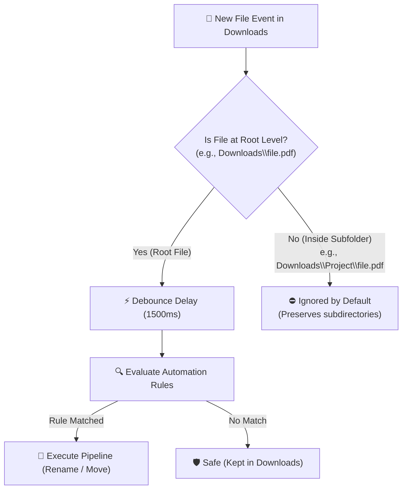
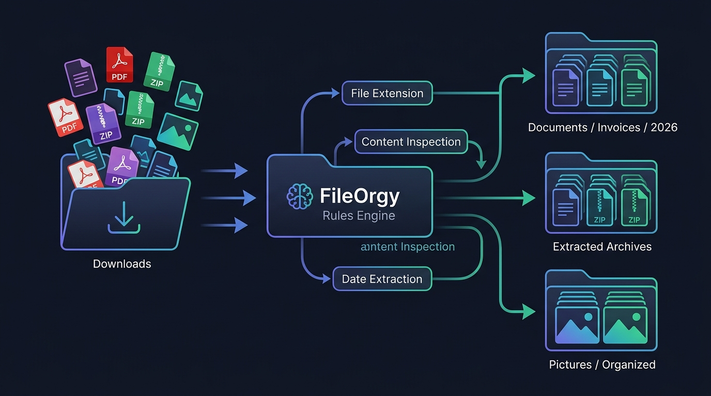
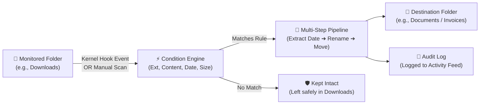
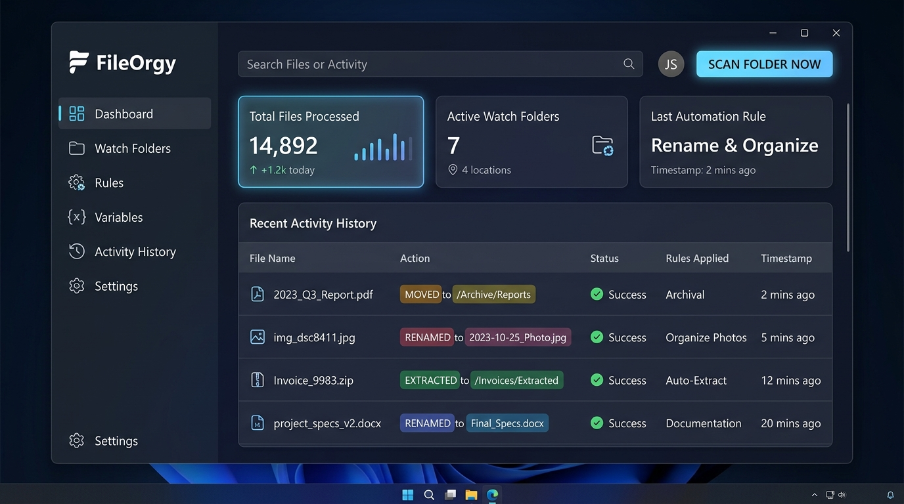
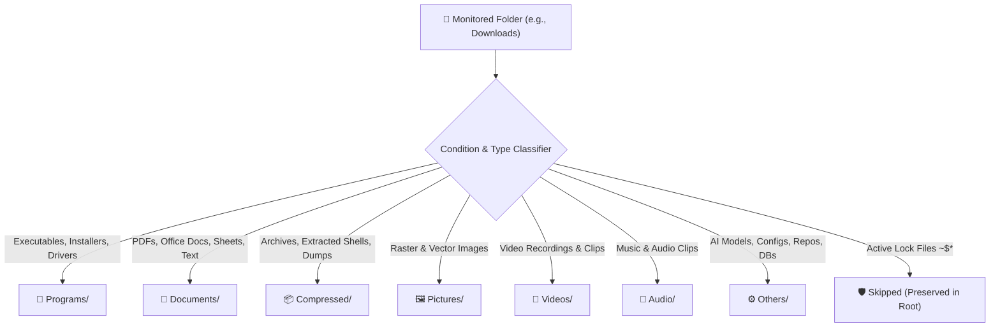

# FileOrgy: Comprehensive Visual Workflow Guide & Tutorial

Welcome to **FileOrgy**! This guide walks you through how FileOrgy works, how to check whether your **Downloads** folder is organized, how to interpret the UI, and how to create custom automation rules.

---

## 1. Quick Start: How to Check if Your Downloads Folder is Organized

If you just opened FileOrgy and are looking at your Downloads folder, here is what you need to know:

> [!IMPORTANT]
> **1. Strict Root-Only Isolation (Safe by Default):**
> FileOrgy is configured by default to **only touch files sitting directly at the root** of the watch folder (e.g., `Downloads\invoice.pdf`). It will **NEVER inspect, touch, rename, or move files inside existing subdirectories** (such as project folders, extracted software, or Git repositories).
>
> **2. Real-Time vs. Existing Files:**
> * **Real-Time Monitoring:** When monitoring is **Active**, FileOrgy automatically detects and organizes **new files** the moment they are written to the root of your folder.
> * **Existing Files:** Files that were *already* in your Downloads folder before launching FileOrgy are **not moved automatically** until you trigger a **Scan**. This prevents accidental mass file reorganizations without your explicit intent.

### Step-by-Step: Check & Organize Downloads Right Now

1. **Open FileOrgy** on your screen.
2. In the top-right header, click the **`⚡ Scan Folder Now...`** button.
   *(Alternatively, switch to the **📁 Watch Folders** tab on the left, select **Downloads Folder**, and click **`⚡ Scan Selected`**).*
3. Select your `Downloads` directory (or let it scan the default configured `Downloads Folder`).
4. Switch to the **📊 Dashboard** or **📜 Activity History** tab to verify results:
   * **🟢 Success (Green):** The file matched an automation rule (e.g., an invoice PDF was renamed with its internal date and moved to `Documents\Invoices\2026\09`, or a ZIP archive was extracted and recycled).
   * **🔵 Evaluated / Kept in Place (Info):** The file did **not** match any active rule (e.g., an application installer `.exe`, Photoshop `.psd`, or project folder). FileOrgy safely leaves it untouched in your Downloads folder.
5. **Open Windows Explorer (`Win + E`):**
   * Navigate to `Downloads` to confirm only unhandled files and project folders remain.
   * Navigate to your target folders (e.g., `Documents\Invoices` or `Pictures\Organized`) to see your sorted files.
6. If files remain in Downloads that you want organized, simply create a rule for them (see [Section 5](#5-how-to-create-custom-rules-for-downloads)).

---

## 2. The Core Architecture & Mental Model

Here is how FileOrgy processes files:

### The Automation Pipeline

1. **Watch Folders:** The Windows kernel (`ReadDirectoryChangesW`) monitors specified folders with zero polling and near-zero CPU.
2. **Debounce Delay:** FileOrgy waits a brief moment (e.g., 1.5s) until a browser or app finishes writing the download before processing.
3. **Condition Evaluator:** Tests the file against rules (sorted by priority). Conditions can inspect:
   * **File Extension** (e.g., in `.pdf`, `.docx`, `.zip`)
   * **Document Content** (reads inside PDFs, Word docs, Excel sheets)
   * **Dates** (creation date, modification date, or extracted invoice date)
   * **File Size** (bytes, KB, MB)
4. **Multi-Step Workflow:** When a rule matches, its ordered steps execute:
   * **Extract Date:** Reads the internal document or photo date.
   * **Smart Rename:** Formats the filename with tokens like `{doc_date:yyyy-MM-dd}_{basename}{dotext}`.
   * **Move / Copy File:** Sorts into structured directories like `{var:BaseDocuments}\Invoices\{doc_date:yyyy}\{doc_date:MM}`.
   * **Extract Archive:** Automatically uncompresses `.zip`, `.rar`, `.7z`, or `.tar.gz` and sends the compressed file to the Recycle Bin.
   * **Recycle / Cleanup:** Safely cleans up stale temporary files.

---

## 3. UI / UX Tour: Navigating the 6 Tabs

### 📊 1. Dashboard Tab
* **Monitoring Toggle Button:** Located in the top header (`Pause Monitoring` / `Resume Monitoring`). When paused, the indicator turns amber and incoming file events are queued.
* **Top Header `⚡ Scan Folder Now...`:** Lets you pick any folder on your PC to immediately run all rules against.
* **KPI Metric Cards:**
  * **Total Files Processed:** Lifetime count of automated files.
  * **Operations Today:** Actions taken during the current calendar day.
  * **Active Watch Folders:** Number of folders actively receiving instant kernel hooks.
  * **Cleaned / Saved Space:** Total megabytes or gigabytes of disk space freed up.
* **Real-Time Operation Feed:** A live scrollable data table displaying the most recent 100 actions with timestamp, event type, file name, and result details.

### 📁 2. Watch Folders Tab
* Displays all directories monitored by FileOrgy.
* **Add Watch Folder:** Click `+ Add Watch Folder` to browse for a new folder (e.g., `Desktop`, `Torrents`, `Temp`).
* **Scan Selected:** Runs a one-time audit/organization on the selected folder.
* **Folder Settings:** Checkbox to enable/disable monitoring, toggle `Include Subdirectories`, and set custom debounce delays.

### ⚡ 3. Rules & Workflows Tab
* Lists all your automation rules in order of **execution priority** (top to bottom).
* **Move Up / Down:** Change priority ordering. The first matching rule executes first.
* **Edit Rule:** Opens the visual **Rule Editor Dialog** where you can:
  * Name and describe the rule.
  * Define matching logic (**Match ALL conditions** vs **Match ANY condition**).
  * Configure conditions (Target: Name, Extension, File Size, Content, Document Date).
  * Add multi-step actions (Extract Date, Rename, Move, Extract Archive, Recycle).
* **Duplicate Rule:** Clone an existing rule to quickly create variations.

### 🏷️ 4. Variables & Lists Tab
* **Custom Variables:** Define reusable paths and text tags. For example:
  * `{var:BaseDocuments}` = `C:\Users\swalih\Documents`
  * `{var:TaxYear}` = `2026`
* **Keyword Lists:** Reusable lists of extensions or terms. Editing a list updates all rules using it:
  * `FinancialKeywords`: `invoice, receipt, statement, bill, tax, payment`
  * `DocumentExts`: `pdf, docx, xlsx, pptx, txt, csv`
  * `ArchiveExts`: `zip, 7z, rar, tar, gz`

### 📜 5. Activity History & Log Interpretation
* Complete, searchable audit log of every file detected, evaluated, renamed, moved, or extracted.
* **Search Filter:** Type any filename, date, or path to filter logs instantly.
* **Log Level Filter:** Filter by `All`, `Info`, `Warning`, or `Error`.
* **Export Buttons:** Export your complete log history to **CSV** or **JSON** for auditing.
* **Right-Click Explorer Integration:** Right-click any log row to "Open Containing Folder" or "Copy Path".

#### How to Interpret Log Levels & Event Badges

| Badge / Level | Meaning & Context | Typical Action / Message |
|---|---|---|
| 🟢 **Success** | Step executed cleanly | `Moved to C:\Users\...\Documents\Invoices\2026\09\file.pdf` |
| 🔵 **Info** | Normal operational events | `Matched rule 'Organize Invoices'. Starting 3 workflow steps.` `No matching rule for 'tool.exe'. Left untouched in folder.` |
| 🟡 **Warning** | Non-fatal condition | A step had an issue, but `Continue on Error` allowed workflow to proceed. |
| 🔴 **Error** | Action failed | File was locked by an active process, permission was denied, or path was invalid. |

> [!TIP]
> **Understanding "No matching rule... Left untouched":**
> If you see `No matching rule for 'file.zip'. Left untouched in folder.` with an `Info` badge, this is **not an error**. It indicates FileOrgy inspected the file and deliberately chose not to alter it because none of your active rules matched.

* **Log Storage Location:** Operations are automatically persisted to disk in JSON Lines format at:
  `%LocalAppData%\FileOrgy\logs\activity.jsonl`
* Log entries are buffered in-memory and flushed asynchronously every 2 seconds, keeping disk I/O at near-zero.

### ⚙️ 6. Settings Tab
* **Start with Windows:** Enables silent system startup via Windows registry.
* **Minimize to Tray on Close:** Closing the window with `[X]` keeps FileOrgy running silently in your system notification tray.
* **Desktop Notifications:** Shows Windows toast notifications when files are organized.
* **Global Debounce Delay:** Default time to wait for file writing to finish before triggering rules (default: `1200ms`).
* **Max Concurrent Operations:** Controls background worker threads (default: 2 threads for bounded CPU impact).

---

## 4. Built-In In-Place Organization System (The 7-Category Architecture)

FileOrgy provides a turnkey **In-Place Organization Engine** engineered to maintain a tidy root directory without scattering your files across external drives or user libraries. When activated, it routes incoming or existing items directly into 7 structured subdirectories within the watched folder (e.g., `Downloads\[Category]\`).

### The 7 Universal Categories & Payload Reference

| Category | Typical File Extensions & Payloads | Common Examples |
| :--- | :--- | :--- |
| **💾 Programs** | `.exe`, `.msi`, `.dmg`, `.bat`, standalone software bundles | `Docker Desktop Installer.exe`, `python-3.12.0-amd64.exe`, `Antigravity IDE.exe`, `setup.msi`, `sharp-driver-setup.exe` |
| **📄 Documents** | `.pdf`, `.docx`, `.xlsx`, `.csv`, `.pptx`, `.md`, `.txt`, `.html` | Invoices, technical specifications, `computers_and_servers.xlsx`, `sick-leave-03-09-2026.pdf`, `WEEKLY ROOM CLEANING.docx` |
| **📦 Compressed** | `.zip`, `.rar`, `.7z`, `.tar`, `.gz`, plus uncompressed staging folders | `somefile.zip`, `DB05092026.rar`, `drive-download-20260401T.../`, `zipfile_6625b5.../`, extracted empty shells |
| **🖼️ Pictures** | `.jpg`, `.jpeg`, `.png`, `.gif`, `.svg`, `.webp`, `.bmp`, `.ico` | Camera photos, screenshots, UI icons, `barcode.gif` |
| **🎥 Videos** | `.mp4`, `.mkv`, `.mov`, `.avi`, `.webm`, `.wmv`, `.flv` | Screen recordings, webinars, video downloads, tutorials |
| **🎵 Audio** | `.mp3`, `.wav`, `.flac`, `.m4a`, `.aac`, `.ogg`, `.wma` | Podcasts, music tracks, voice notes, sound effects |
| **⚙️ Others** | `.gguf`, `.alloy`, `.ps1`, `.py`, `.json`, `.xml`, `.ini`, `.rdp`, Git repos, DB dumps | Quantized AI LLM weights (e.g. `Qwen3.5-9B.gguf`), Grafana configs, PowerShell scripts, `QuranApp-master/`, `DB18072026/` |

---

### How to Trigger In-Place Organization

You can trigger in-place organization across your watched folders in three ways:

1. **Top Header One-Click Scan:**
   * In FileOrgy, click **`⚡ Scan Folder Now...`** in the top right.
   * Select your target directory (e.g., `C:\Users\swalih\Downloads`).
   * FileOrgy evaluates all root items, matches rules, and routes them into the 7 category folders.
2. **Dedicated Watch Folder Scan:**
   * Go to the **📁 Watch Folders** tab on the left.
   * Select **Downloads Folder** and click **`⚡ Scan Selected`**.
3. **Autonomous Background Monitoring:**
   * When monitoring is active (green indicator), any new download or file dropped into the root of `Downloads` is debounced (waiting until browser writing completes) and automatically sorted into its corresponding category subfolder.

---

### How to Customize In-Place Rules

The in-place rules can be tailored to suit your specific workflow:

* **Modifying Extensions in Keyword Lists:**
  * Open the **🏷️ Variables & Lists** tab.
  * Select `DocumentExts`, `ArchiveExts`, or `MediaExts`.
  * Add or remove extensions (e.g., add `psd` to `MediaExts` if you prefer Photoshop files in Pictures instead of Others).
* **Creating Category-Specific Routing Rules:**
  * Go to **⚡ Rules & Workflows** and click **`+ New Rule`**.
  * Use **Destination Templates** relative to the watched directory:
    * `DestinationTemplate`: `{parent}\Programs` or `{parent}\Documents`
    * Or absolute: `C:\Users\swalih\Downloads\Programs`
* **Preserving Atomic Folder Integrity:**
  * Keep `Include Subdirectories` **unchecked** on the Watch Folder. This ensures FileOrgy treats composite folders (like Git repos or software installs) as single units and never descends into them to scramble nested child files.
* **Temporary Lock File Protection:**
  * FileOrgy automatically respects ignore patterns (`~$*`, `*.tmp`, `*.crdownload`), ensuring active Microsoft Office lock files and ongoing browser downloads are never disturbed.

---

## 5. How to Create Custom Rules for Downloads

### Renaming & Path Tokens Reference Cheat Sheet

When creating Rename or Move steps, you can use dynamic tokens:

| Token | Description | Example Output |
|---|---|---|
| `{basename}` | Original filename without extension | `invoice_acme` |
| `{ext}` | Extension without leading period | `pdf` |
| `{dotext}` | Extension with leading period | `.pdf` |
| `{filename}` | Full original filename | `invoice_acme.pdf` |
| `{date:format}` | Current system date | `{date:yyyy-MM-dd}` ➔ `2026-09-05` |
| `{doc_date:format}` | Extracted document / photo date | `{doc_date:yyyy-MM}` ➔ `2026-09` |
| `{counter:001}` | Padded incremental sequence | `001`, `002`, `003` |
| `{var:Name}` | Global custom variable | `{var:BaseDocuments}` ➔ `C:\Users\...\Documents` |
| `{match:1}` | Captured regex group | Captured invoice or customer number |

---

### Common Rule Recipes

#### Example A: Automatically Organize Software Installers (`.exe`, `.msi`)

1. Go to **⚡ Rules & Workflows** and click **`+ New Rule`**.
2. Set **Rule Name**: `Sort Software Installers`.
3. Set **Match Logic**: `Match ANY condition (OR)`.
4. Click **`+ Add Condition`**:
   * Target: `Extension` | Operator: `Equals` | Value: `exe`
5. Click **`+ Add Condition`**:
   * Target: `Extension` | Operator: `Equals` | Value: `msi`
6. Under **Workflow Steps**, click **`+ Add Step`**:
   * Step Type: `MoveFile`
   * Destination: `C:\Users\swalih\Downloads\Installers`
   * Conflict Resolution: `AutoRenameUnique`
7. Click **`Save Rule`**.
8. Now, click **`⚡ Scan Selected`** on Downloads, and all `.exe` and `.msi` files will cleanly move into `Downloads\Installers`!

#### Example B: Automatically Sort Images into Dated Folders

By default, FileOrgy includes the **Organize Photos & Images** rule:
* Matches `.jpg`, `.jpeg`, `.png`.
* Extracts the photo EXIF date (falling back to file creation date).
* Moves files to `Pictures\Organized\{doc_date:yyyy}\{doc_date:MM}`.
* Renames them with duplicate protection (`AutoRenameUnique`) so you never overwrite photos.

#### Example C: Smart Invoices & Financial Documents Router

By default, FileOrgy includes the **Organize Invoices & Receipts** rule:
* Matches files whose extension is in `DocumentExts` (`pdf, docx, xlsx, txt`).
* Inspects document content for matches against `FinancialKeywords` (`invoice, receipt, statement, bill, tax, payment`).
* Extracts the internal document date (e.g., reads invoice date text inside the PDF).
* Renames to `{doc_date:yyyy-MM-dd}_{basename}{dotext}`.
* Moves to `Documents\Invoices\{doc_date:yyyy}\{doc_date:MM}`.

---

## 6. System Tray & Background Operation

When you close FileOrgy, it minimizes to the Windows System Tray (near the clock):

* **Double-click the Tray Icon:** Restores the main window immediately.
* **Right-click the Tray Icon:**
  * **Open FileOrgy:** Opens the UI.
  * **Pause / Resume Monitoring:** Temporarily suspends folder hooks.
  * **Scan Folder Now...:** Quickly organizes any folder without needing to open the full UI.
  * **Exit FileOrgy:** Completely shuts down the application and releases all hooks.

> [!TIP]
> **Safety First (Recycle Bin Integration):** If FileOrgy ever deletes or cleans up an old file via a Cleanup or Archive post-action step, it uses native Windows Shell `SHFileOperationW`. This means files are **never permanently deleted** unless explicitly configured—they are placed into the **Windows Recycle Bin**, where you can restore them with one click if needed.
